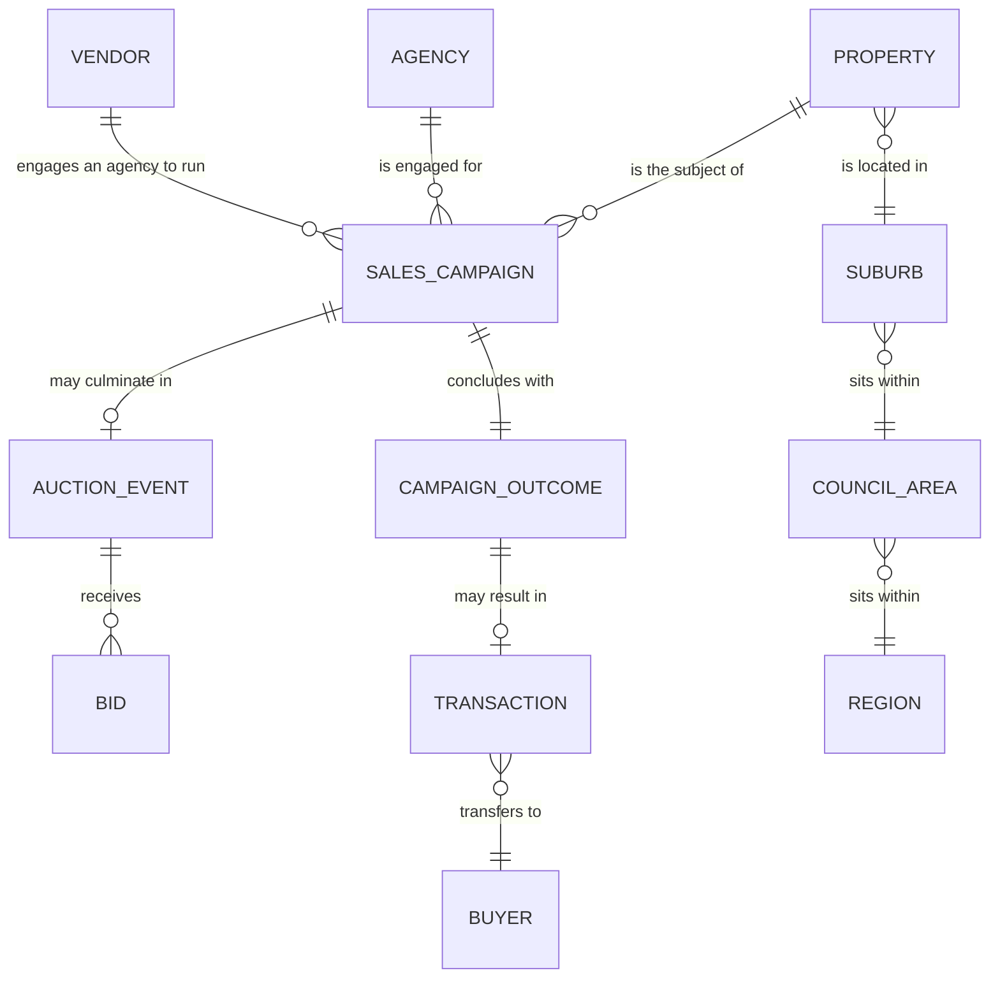
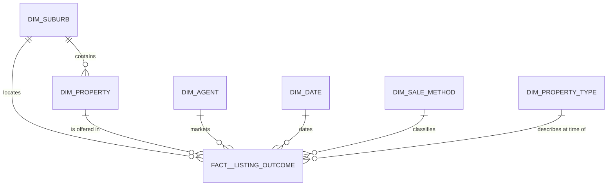

# Melbourne housing pipeline

## Objective

Turn a CSV of Melbourne property listings into a warehouse an analyst can query: ingested with
row-level error handling, modelled as a star schema, tested, incremental, and orchestrated.

```bash
make setup && make all
```

Rebuilds everything from the source file in about eleven seconds. No cloud account, no Docker.

Source: `MELBOURNE_HOUSE_PRICES_LESS.csv` — 63,023 rows, 2016-01-28 → 2018-10-13.

---

## Business questions

Five questions, and the grain each one needs. Everything downstream serves these.

| # | Question | Grain | Model |
|---|---|---|---|
| 1 | How is a suburb performing month to month, and is it accelerating? | suburb × month | `analytics_suburb_monthly_market` |
| 2 | Which agents win in a region, and how much of it do they hold? | agent × region × month | `analytics_agent_performance` |
| 3 | When a property sells twice, how long was it held and what did it return? | resale pair | `analytics_repeat_sales` |
| 4 | How far apart are what vendors want and what the market pays? | bid → later sale | `analytics_vendor_expectation_gap` |
| 5 | What did we exclude, and does it reconcile to source? | fact + quarantine | `quarantine_recaptured_listing` |

Two of these drove the model. **Clearance rate is sales ÷ all outcomes**, so the fact keeps
unsold listings — filtering to sales destroys the denominator. And question 4 only exists
because the bid figure on unsold rows is preserved as its own measure.

**A finding out of question 4:** across the 211 properties passed in at a known figure and
later sold, the market paid a **median 3.9% above** the highest bid, and 143 of 211 sold above
it. Reserves in this market were, on the whole, a little pessimistic.

---

## Design

### Conceptual



The pivot is `CAMPAIGN_OUTCOME ||--o| TRANSACTION`: **a campaign concluding is not the same
event as a property changing hands.** The source gives one row per campaign outcome, so that
is the fact grain — a superset of "sale", which is what makes clearance computable.

It also means `Price` is overloaded, because the bid and the consideration share one column:

| | price present | price NULL |
|---|---|---|
| **sold** (`S SP SA SN PN SS`) | 37,469 | 9,324 |
| **not sold** (`PI VB W`) | **10,964** | 5,266 |

Those 10,964 rows carry a highest or vendor bid, not consideration paid — `AVG(price)` is ~23%
contaminated and returns a plausible wrong number rather than a null. So the warehouse has no
column called `price`. It has `sale_price` and `bid_amount`, mutually exclusive, with tests
asserting no row populates both.

Full entity mapping — what the source keeps, collapses and omits — in
[docs/data-model.md](docs/data-model.md).

### Physical




Every relationship into the fact is many-to-one — no bridge tables. Nothing carries an
effective date, so every dimension is Type 1. A property sits in exactly one suburb; 1,092
properties have more than one outcome and one has four; 573 were marketed by more than one
agency, so property is not tied to agent.

Three calls worth naming:

- **`rooms` and `type` are point-in-time, not property attributes.** Across properties with
  multiple outcomes `rooms` differs for 112 and `type` for 72 — `2/73 Bignell Rd` is listed
  once as a unit and once as a townhouse. `dim_property` holds identity only.
- **The fact carries `suburb_key` as well as `property_key`.** Suburb is the primary analysis
  grain; routing every query through a 58,696-row dimension is slower and easier to get wrong.
  A test asserts the two agree on every row.
- **`dim_date` is a generated spine.** Only 112 days in three years carry activity, so a
  `DISTINCT`-derived date dimension omits quiet months and `LAG` silently compares
  non-adjacent ones.

Materialisation is per layer, not global:

| Layer | Materialisation | Why |
|---|---|---|
| `stg__listing_outcome` | incremental, append | an immutable event log — it only grows |
| `int__listing_outcome` | table | cheap derivation, no windows |
| `int__listing_outcome_clustered` | incremental, partition overwrite | the expensive part: windows over each property's history |
| `..._deduped`, `quarantine_...` | views | complementary filters over one classification, so they cannot drift |
| `fact__listing_outcome`, `dim_property` | incremental, partition overwrite | grow with event volume |
| other dims, all analytics | table | bounded by dimension cardinality, not event volume |

That last row is a bug fix, not a shortcut. With the analytics models incremental, the
equivalence harness caught two staleness defects: a canonical agency spelling drifted in
region-months nothing had touched, and extending `dim_date` added months to untouched suburbs'
grids. Aggregates over a whole dimension must be recomputed over the whole dimension
([ADR-0011](docs/adr/0011-incremental-by-layer.md)).

On BigQuery the fact partitions `DATE_TRUNC(event_date, MONTH)` and clusters on
`suburb_key, property_key` — monthly because the 4,000-partition cap makes daily run out after
eleven years. [docs/warehouse-physical-design.md](docs/warehouse-physical-design.md).

### Technical — the ETL

```
CSV → loader → Parquet landing → dbt (staging → intermediate → marts → analytics) → DuckDB
```

**Ingestion.** The loader streams the file, asserts the 13-column header exactly including
order, coerces types row by row, and routes failures to a reason-coded reject store rather than
aborting. Dates that are unparseable, in the future, or before 1900 are rejected — typing
validates form, never plausibility, and `30/12/2087` parses fine. Output:

- `data/landing/listing_outcome/load_id=<id>/` — accepted rows
- `data/rejects/load_id=<id>/` — rejects with reason and original text
- `data/ingest_receipt/<id>.json` — counts, source SHA-256, timings, event-date range

`load_id` is the source SHA-256 prefix, so re-running identical bytes overwrites the same
partition instead of accumulating copies. A test asserts byte-identical output across runs.

**Deduplication.** The feed republishes. 860 groups of rows are identical on every column
*except* `Date`, and 786 span exactly five dates:

```
25/11/2017 Sat 902 │ 09/12/2017 Sat 928     ← real Saturdays vary
16/12/2017 Sat 787 │ 23/12 787 │ 30/12 787 │ 06/01 787 │ 08/01 787 (Mon)
20/01/2018 Sat  19 │ 27/01/2018 Sat  12     ← the real market over the shutdown
```

Five consecutive dates at *exactly* 787 rows during the Christmas auction shutdown. The feed
stopped updating and republished the 16/12 snapshot four more times, stamped with the capture
date. Left in, it inflates December–January volume fivefold and wrecks question 3: 689
properties look like they sold twice at a disclosed price; 172 actually did.

There are three duplication classes, needing opposite rules:

| Class | Signature | Rows |
|---|---|---|
| `suspected_recapture` | same content, **different** date | 3,200 |
| `suspected_restatement` | same date, **different** content — a price published later | 5 |
| `exact_duplicate` | the same row twice | 2 |

The first two are exact opposites, so no single key catches both: one containing the price is
blind to restatements, one containing the date is blind to recaptures. Both resolve in one
expression, so survivors and quarantine are complementary by construction. The 21-day window
sits in empty space — observed gaps cluster at 2 and 7, the next is 14, then 49 — and both
edges are pinned by unit tests. Nothing is deleted, so the call is auditable.

**The row ledger.**

```
59,816 (fact) + 3,207 (quarantine) = 63,023 (staged) = rows_loaded on the ingest receipt
```

A dbt test, not a comment. Staging is row-preserving so the chain has an anchor, and every
later drop must be matched by a quarantine row carrying its reason.

**Incremental.** Daily files overlap: the same sale arrives several times, sometimes restated
with a price published after the fact. The unit of work is the **property**, because that is
what both dedup rules partition by:

| Rule | Partitions by |
|---|---|
| restatement | `property, event_date, method, agent` |
| recapture | content signature beginning with `property` |

No dedup group can span two properties — asserted by a singular test — so reprocessing a
property's *entire* history is always complete. That removes the look-back window rather than
sizing it. A median auction day touches 570 of 58,696 properties, under 1%.

An `event_date` window would be actively wrong: a restatement arrives today carrying its
original date, so a 2001 sale having its price published is invisible to any window anchored on
"recent" — the correction is applied never, and nothing fails.

The write is a **partition overwrite** — a `pre_hook` deletes the affected properties, then the
model appends. `insert_overwrite` semantics, emulated because dbt-duckdb has no such strategy;
on BigQuery it is the native one. Two properties of that:

- **Not `merge`.** When a later delivery makes an existing outcome a recapture, that fact row
  must stop existing. Merge only updates rows the incoming set matches, so it would report two
  sales where one occurred.
- **A partition is not a unique key.** `property_key` is deliberately non-unique in the fact —
  that is what a many-to-one dimension key means. Each model's real row key is asserted by an
  ordinary test instead: `(load_id, source_row)` on staging and the clustered model,
  `listing_outcome_key` on the fact, `property_key` on `dim_property`.

`make test-equivalence` proves it: split the real CSV into five daily deliveries, re-send one
verbatim, inject a restatement, build incrementally load-by-load and then from scratch, compare
all ten tables row for row.

**Orchestration.** `ingest → dbt_build → dq_gate`, with retries and exponential backoff,
`on_failure_callback` posting to Slack (a no-op when `SLACK_WEBHOOK_URL` is unset), and a gate
that reads the ingest receipt and fails the run on an unreconciled ledger, a reject-rate spike,
or a row count outside the expected band. `ingest` hands its `load_id` to `dbt_build` via XCom,
which is what sets the incremental scope.

Three tasks, not one per model: dbt already derives the graph from `ref()`, so mirroring it
into Airflow maintains the same DAG twice and only one copy fails loudly when they diverge. On
a real warehouse that inverts and `astronomer-cosmos` becomes right
([ADR-0003](docs/adr/0003-airflow-owns-phases-dbt-owns-lineage.md)).

---

## How to run

```bash
./install.sh --csv /path/to/MELBOURNE_HOUSE_PRICES_LESS.csv
make all
```

The dataset is not committed, so point the installer at the CSV. It checks for
[uv](https://docs.astral.sh/uv/) and offers to install it, provisions the Python version,
installs dependencies and dbt packages, and verifies by parsing the project and running the
tests that need no data. Re-running it is safe.

| Flag | Does |
|---|---|
| `--csv <path>` | copy the source file into `data/raw/` |
| `--with-airflow` | also build the Airflow environment (separate venv — its pins conflict with dbt-core's) |
| `--yes` | never prompt, for CI |

Then:

```bash
make all       # ingest + build the whole warehouse
make test      # Python tests, then every model and every test
```

| Command | Does |
|---|---|
| `make ingest` | CSV → Parquet landing zone |
| `make build` | every model and every test, in dependency order |
| `make test-unit` | dbt unit tests only — no warehouse data needed |
| `make test-equivalence` | prove the incremental build matches a full rebuild |
| `make test-dag` / `make airflow` | DAG structure tests, local Airflow run |
| `make ui` / `make sql` | DuckDB browser UI / SQL prompt |
| `make docs` | generate and serve the dbt docs site |
| `make clean` | remove derived data, keep `data/raw` |

Simulating a daily delivery — what the DAG does:

```bash
uv run dbt build --project-dir dbt --profiles-dir dbt --vars '{"load_ids": ["<load_id>"]}'
```

### Querying it

| How | Command |
|---|---|
| Browser notebook | `duckdb -ui data/warehouse.duckdb` |
| SQL prompt | `duckdb data/warehouse.duckdb` |
| Off Parquet — **takes no lock** | `duckdb -c "select * from 'data/landing/**/*.parquet' limit 10"` |
| Model preview | `uv run dbt show --select <model> --project-dir dbt --profiles-dir dbt` |

DuckDB is single-writer: while a build holds the file, another process cannot connect at all.
Query between runs, or query the landing zone. The DAG sets `max_active_runs=1` for the same
reason.

---

## Data dictionary

### `marts.fact__listing_outcome` — 59,816 rows

One row per listing outcome: a campaign for one property on one event date, sold or not.

| Column | Type | Meaning |
|---|---|---|
| `listing_outcome_key` | VARCHAR | Surrogate key. Unique, tested |
| `property_key` | VARCHAR | → `dim_property`. Many-to-one |
| `suburb_key` | VARCHAR | → `dim_suburb`. Denormalised; tested against the property |
| `agent_key` | VARCHAR | → `dim_agent` |
| `event_date` | DATE | → `dim_date` |
| `method_code` | VARCHAR | → `dim_sale_method` |
| `type_code` | VARCHAR | → `dim_property_type`. As at this outcome |
| `rooms` | INTEGER | As at this outcome |
| `sale_price` | DOUBLE | Consideration paid. Null unless sold **and** disclosed |
| `bid_amount` | DOUBLE | Highest or vendor bid. Null unless **not** sold |
| `sale_price_is_disclosed` | BOOLEAN | True only for a sale with a published price |
| `is_sold` / `is_auction` | BOOLEAN | From `dim_sale_method` — the authoritative rule |
| `load_id` / `source_row` | VARCHAR / INTEGER | Lineage back to the ingest receipt |

### Dimensions

| Table | Rows | Grain and notes |
|---|---|---|
| `dim_suburb` | 377 | Lowercased name. Holds postcode, region, council, `cbd_distance_km`, `property_count` — functionally determined by suburb, asserted every build |
| `dim_property` | 58,696 | `(suburb, street address)`. Identity only |
| `dim_agent` | 470 | Lowercased agency name |
| `dim_date` | 1,035 | Generated spine. `is_saturday` — 91% of outcomes fall on one |
| `dim_sale_method` | 10 | `method_code`, `is_sold`, `is_auction` |
| `dim_property_type` | 6 | `h`, `u`, `t` occur |

Suburb and agent counts are **entity** counts — 380 and 476 spellings collapse to 377 and 470.
Dimensions key on the lowercased value and pick the display spelling by frequency, tie-broken
alphabetically so rebuilds are deterministic.

### Analytics

| Model | Rows | Metrics |
|---|---|---|
| `analytics_suburb_monthly_market` | 12,818 | clearance, median price, price per room, MoM change, 3-month average, rank in region |
| `analytics_agent_performance` | 7,741 | GMV, share of region, `dense_rank`, clearance, auction share |
| `analytics_repeat_sales` | 150 | holding period, gain, annualised return |
| `analytics_vendor_expectation_gap` | 211 | gap amount and percentage, days to sale |

The suburb model is built over a **complete** suburb × month grid, of which 4,630 rows are
zero-activity months — aggregating only observed months would let `LAG` compare non-adjacent
ones while looking correct.

### `intermediate.quarantine_recaptured_listing` — 3,207 rows

Every excluded row with its reason, `surviving_event_date` and
`days_since_previous_appearance`. Quarantined rather than deleted, so exclusions are provable
and challengeable.

---

## Testing

**193 tests, zero warnings**, clean rebuild in about eleven seconds. No test sits at `warn`
severity.

| Kind | Count |
|---|---|
| dbt data tests | 99 |
| dbt unit tests | 43 |
| pytest — loader, quality gate | 42 |
| pytest — DAG structure | 9 |

Plus `make test-equivalence`, which is what actually proves the incremental design.

Test-first for everything with real logic; dimensions and passthrough columns are
contract-tested ([ADR-0007](docs/adr/0007-tdd-the-logic-contract-test-the-plumbing.md)). The
git history shows each failing test committed before its implementation.

Three guard mistakes that are invisible once made:

- **Auction share must not be structurally zero.** Deriving it from a code whose rows are
  filtered out upstream yields a column mathematically incapable of being non-zero. Reads
  non-zero for 6,950 agent-months.
- **No repeat-sale pair inside the recapture window.** A seven-day pair at an identical price
  is a republished snapshot. Minimum observed holding period: 28 days.
- **No cluster may exceed the reprocessing look-back**, so that parameter polices itself.

---

## Limitations

- No area column, so price per m² is replaced by price per room and price by type.
- The 21-day recapture window is a judgement call; the quarantine makes it auditable.
- 9,324 sales have no disclosed price, capping price coverage at 59.5% of outcomes. Volume and
  clearance cover 100%.
- Addresses are unstandardised and agency names carry aliases and co-listings, so property and
  agency identity are approximate.
- A retraction — the source deleting a record it published in error — cannot be expressed
  without tombstones in the feed contract.
- Days-on-market, reserve gap, bid depth and buyer behaviour are not in the source.
- DuckDB-specific: `generate_series` in `dim_date`, the `on-run-start` landing view, and
  `count(*) filter`. Surrogate keys, window functions and the test suite are portable.

## Future improvements

- Address standardisation and geocoding, growing the repeat-sale population past 149
  properties.
- Enrich from `Melbourne_housing_FULL.csv` for building area and coordinates.
- Source freshness check — the re-scrape artefact is exactly what one would have caught at
  ingestion — plus Elementary for test-result history.
- CI running the full suite on every push, dbt docs published as an artifact.
- Seasonality adjustment; Melbourne's spring peak and January trough currently read as
  momentum.

## AI assistance

Built in a single session with **Claude Code (Claude Opus 5)**, interactively rather than
generated whole.

**Mine:** the stack, the coarse DAG, the fact grain, the measure split, quarantining rather
than deleting, layer naming, which analytics models to build, and the incremental redesign —
including rejecting the first cut, which had a partition key sitting in a `unique_key` config.
The architecture diagram is hand-drawn.

**The model's:** profiling the source — which is what surfaced the re-scrape artefact and the
price overload — then writing the tests, loader, models and docs, and verifying every number
here against the built warehouse.

**Method:** every decision was argued out before code — engine, orchestrator, grain, measures,
deduplication, testing, incrementality — producing eleven ADRs and `CONTEXT.md`, committed
before the first line of implementation.
