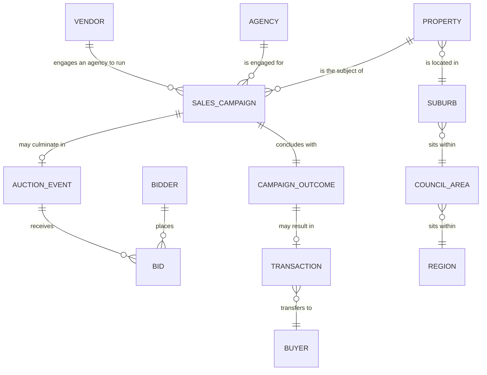
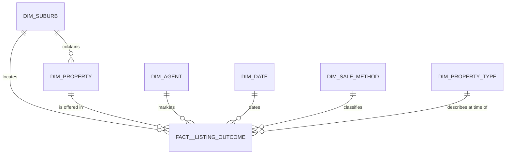

# Melbourne housing pipeline

## Objective

Take a CSV of Melbourne property listings and turn it into a warehouse someone can actually
ask questions of — ingested with real error handling, modelled as a star schema, tested, and
run on a schedule.

```bash
make setup && make all
```

That rebuilds everything from the source file in about eleven seconds. No cloud account, no
credentials, no Docker.

The source is `MELBOURNE_HOUSE_PRICES_LESS.csv`: 63,023 rows, 13 columns, covering
2016-01-28 → 2018-10-13. Three things in it shaped the design more than the brief did, and
each one is called out where it forced a decision below.

---

## Business questions

I wasn't given a stakeholder, so I picked the questions a property analyst would actually
ask, and worked backwards from them. Everything else in this document exists to serve these
five.

| # | Question | Smallest grain that answers it | Model |
|---|---|---|---|
| 1 | How is a suburb performing month to month — volume, clearance, typical price — and is it accelerating? | every outcome, sold or not, at suburb × month | `analytics_suburb_monthly_market` |
| 2 | Which agents win in a region, and how much of it do they hold? | outcome × agent × region × month | `analytics_agent_performance` |
| 3 | When a property sells twice, how long was it held and what did it return? | two dated sales for one property | `analytics_repeat_sales` |
| 4 | How far apart are what vendors want and what the market pays? | a passed-in bid and a later sale on the same property | `analytics_vendor_expectation_gap` |
| 5 | How much of the market do we have prices for, and what did we exclude and why? | the fact plus the quarantine, reconciling to source | `fact__listing_outcome` + `quarantine_recaptured_listing` |

Question 1 is why the fact keeps unsold listings: **clearance rate is sales ÷ all outcomes**,
so a table filtered to sales destroys the denominator. Question 4 only works because the bid
figure on unsold rows survives as its own measure. Both of those are design decisions the
questions forced, not the other way round.

One I couldn't answer: the brief's example metric is *price per square metre*, and this file
has no area column. Enriching from `Melbourne_housing_FULL.csv` yields a computable price/m²
for only 8,317 rows (13.2%) — too thin to carry a headline metric across a second source and a
join. Substituted price per room and price by type.

---

## Design

### Conceptual — the business, not the file

What actually exists in this domain, independent of any dataset:



The pivot of the whole domain is `CAMPAIGN_OUTCOME ||--o| TRANSACTION`: **a campaign
concluding is not the same event as a property changing hands.** Miss that and every average
price in the warehouse is wrong.

The CSV gives one row per campaign outcome. Property, Suburb/Council/Region and Campaign
Outcome survive intact. **Sales Campaign, Auction Event, Bid and Transaction are collapsed
into that one row** — costing days-on-market, price guide, reserve, and the separation of
auction date from campaign end, and leaving at most one bid figure, which is why `Price` is
overloaded. **Vendor, Buyer, Bidder and Reserve are absent entirely**, so bid depth, buyer
behaviour and the true reserve gap are unreachable.

Modelling the four collapsed entities as separate tables anyway would put them in strict 1:1
with each other — one row each per source row — the appearance of normalisation with none of
its substance, and four joins to answer anything. So they're one fact at the grain the source
genuinely supports. Full write-up in [docs/data-model.md](docs/data-model.md).

**The first thing the data forced: `Price` means two different things.**

`Method` says whether the property sold. Often it didn't.

| | price present | price NULL |
|---|---|---|
| **sold** (`S SP SA SN PN SS`) | 37,469 | 9,324 |
| **not sold** (`PI VB W`) | **10,964** | 5,266 |

Those 10,964 rows carry a *highest bid* or a *vendor bid*, not consideration paid. `AVG(price)`
over the priced population is about 23% contaminated — and it returns a plausible wrong number
rather than a null, which is worse. So there is no column called `price` anywhere in the
warehouse. There are two mutually exclusive measures, `sale_price` and `bid_amount`, and tests
assert no row can populate both. That split is also what makes question 4 possible.

### Physical — the star




Every relationship into the fact is many-to-one, so no bridge tables; nothing carries an
effective date, so every dimension is Type 1. A property sits in exactly one suburb (0 span
two), 1,092 properties have more than one outcome and one has four, and 573 were marketed by
more than one agency — so property is not tied to agent.

Three deliberate calls:

- **`rooms` and `type` are not property attributes.** They look like they should be, but
  across properties with multiple outcomes `rooms` differs for 112 and `type` for 72 —
  `2/73 Bignell Rd` is listed once as a unit and once as a townhouse. So they're recorded *as
  at the outcome*. `dim_property` holds identity only.
- **The fact carries `suburb_key` as well as `property_key`.** Denormalisation: suburb is the
  primary analysis grain, and routing every suburb query through a 58,696-row dimension is
  slower and easier to get wrong. A test asserts the two agree on every row.
- **`dim_date` is a generated spine, not observed dates.** Only 112 days in three years carry
  activity. A `DISTINCT`-derived date dimension omits quiet months entirely, and `LAG` then
  compares non-adjacent months while looking perfectly correct.

Materialisation is chosen per layer rather than globally — the second decision worth
defending:

| Layer | Materialisation | Why |
|---|---|---|
| `stg__listing_outcome` | incremental, append | the warehouse's copy of an immutable event log — it only ever grows |
| `int__listing_outcome` | table | cheap derivation, no windows |
| `int__listing_outcome_clustered` | incremental, partition overwrite | the expensive part: windows over each property's history |
| `..._deduped`, `quarantine_...` | views | two complementary filters over one classification, so they cannot drift apart |
| `fact__listing_outcome`, `dim_property` | incremental, partition overwrite | grow with event volume |
| other dims, all analytics | table | bounded by dimension cardinality, not event volume — 377 suburbs won't become 377,000 |

That last row is not a shortcut, it's a bug fix. When the analytics models *were* incremental,
the equivalence harness caught two real staleness defects: a canonical agency spelling drifted
(`VICProp` vs `VICPROP`) in region-months nothing had touched, and extending `dim_date`
silently added months to untouched suburbs' grids. Aggregates over a whole dimension have to be
recomputed over the whole dimension ([ADR-0011](docs/adr/0011-incremental-by-layer.md)).

On a cloud warehouse the fact would be partitioned `DATE_TRUNC(event_date, MONTH)` and
clustered on `suburb_key, property_key` — monthly, not daily, because BigQuery caps a table at
4,000 partitions and daily exhausts that after eleven years.
[docs/warehouse-physical-design.md](docs/warehouse-physical-design.md) works through what a
1980 record does to all of it.

### Technical — the ETL

```
CSV → loader → Parquet landing → dbt (staging → intermediate → marts → analytics) → DuckDB
```

**Ingestion.** The loader streams the file, asserts the 13-column header *exactly* including
order (a positional parse against a drifted header mis-assigns every value silently), coerces
types row by row, and routes failures to a reason-coded reject store instead of aborting. It
rejects dates that are unparseable, in the future, or before 1900 — typing validates form,
never plausibility, and `30/12/2087` parses perfectly. It writes:

- `data/landing/listing_outcome/load_id=<id>/part-0.parquet` — accepted rows
- `data/rejects/load_id=<id>/part-0.parquet` — rejects with reason and original text
- `data/ingest_receipt/<id>.json` — counts, source SHA-256, timings, event-date range

`load_id` is the source SHA-256 prefix, so re-running against identical bytes overwrites the
same partition rather than accumulating copies — idempotency as a property of the design, with
a test asserting byte-identical output across runs.

**The second thing the data forced: 5% of the file is the same data republished.**

860 groups of rows are identical on every column *except* `Date`, and 786 of them span exactly
five dates:

```
25/11/2017 Sat 902 │ 09/12/2017 Sat 928     ← real Saturdays vary
16/12/2017 Sat 787 │ 23/12 787 │ 30/12 787 │ 06/01 787 │ 08/01 787 (Mon)
20/01/2018 Sat  19 │ 27/01/2018 Sat  12     ← the real market over the shutdown
```

Five consecutive dates at *exactly* 787 rows during the Christmas auction shutdown, when the
real market prints 19 and 12. The feed stopped updating and republished the 16/12 snapshot four
more times, stamped with the capture date. **Any dedup key containing `Date` is structurally
blind to this**, because `Date` is precisely what varies.

Left in, it inflates December–January volume roughly fivefold and wrecks question 3: 689
properties appear to have sold twice at a disclosed price; after the collapse, 172 do. **Three
quarters of apparent repeat sales were artefacts.**

There are three duplication classes, and they need opposite rules:

| Class | Signature | Rows |
|---|---|---|
| `suspected_recapture` | same content, **different** date | 3,200 |
| `suspected_restatement` | same date, **different** content — a price published later | 5 |
| `exact_duplicate` | the same row twice | 2 |

The first two are exact opposites, which is why no single key catches both: one containing the
price is blind to restatements, one containing the date is blind to recaptures. Both are
resolved by one expression in `int__listing_outcome_clustered`, so survivors and quarantine are
complementary by construction.

**Why 21 days?** Observed gaps cluster at 2 and 7; the next is 14, then 49, so the boundary
sits in empty space. Both edges are pinned by unit tests — 21 collapses, 22 doesn't. It's still
a judgement call, which is why nothing is deleted: the quarantine exists so anyone who
disagrees can see exactly what it affected.

**The row ledger.**

```
59,816 (fact) + 3,207 (quarantine) = 63,023 (staged) = rows_loaded on the ingest receipt
```

That identity is a dbt test, not a comment. Staging is deliberately row-preserving so the
chain has an anchor, and every later drop must be matched by a quarantine row carrying its
reason. Nothing vanishes silently.

**Incremental strategy.** The feed is a stream of daily files that overlap: the same sale can
arrive several times, sometimes restated with a price published after the fact. The third
design decision is therefore what the *unit of work* is.

The obvious answer — a rolling window on `event_date` — isn't merely imperfect here, it's
actively wrong. A restatement *arrives* today carrying its *original* date, so a 2001 sale
having its price published is invisible to any window anchored on "recent": the correction is
applied never, and nothing fails. The general form of the trap is **filter on when a row
arrived, not on when the event happened.**

The unit of work is the **property**, because that's what the window functions partition by:

| Rule | Partitions by |
|---|---|
| restatement | `property, event_date, method, agent` |
| recapture | content signature beginning with `property` |

Property is in both, so no deduplication group can span two properties — asserted by
`assert_no_dedup_group_spans_two_properties.sql`. Reprocessing a property's *entire* history is
therefore always complete, which removes the look-back window rather than merely sizing it. A
median auction day touches 570 of 58,696 properties, under 1%.

The write is a **partition overwrite**: a `pre_hook` deletes the affected properties, then the
model appends. That's `insert_overwrite` semantics, emulated because dbt-duckdb has no such
strategy; on BigQuery it's the native one with `partition_by`.

Two things about that are worth stating, because they're where I got it wrong first:

- **It is not `merge`, and it can't be.** When a later delivery makes an existing outcome a
  recapture, that fact row must *stop existing*. Merge only updates rows the incoming set
  matches — it has no way to delete what no longer qualifies, so it would report two sales
  where one occurred.
- **A partition is not a unique key.** `property_key` is deliberately non-unique in the fact —
  that's what a many-to-one dimension key means. Writing it into a config slot named
  `unique_key` asserts something untrue, so the partition is expressed as a partition, and
  every model's *real* row key is asserted by an ordinary test: `(load_id, source_row)` on
  staging and the clustered model, `listing_outcome_key` on the fact, `property_key` on
  `dim_property`. That test is what caught an unscoped run appending history twice.

Correctness is proved rather than argued: `make test-equivalence` splits the real CSV into
five daily deliveries, re-sends one verbatim, injects a restatement, builds incrementally
load-by-load and then from scratch, and compares all ten tables row for row.

**Orchestration.** `ingest → dbt_build → dq_gate`, with retries and exponential backoff,
`on_failure_callback` posting to Slack (a no-op when `SLACK_WEBHOOK_URL` is unset, so it runs
unconfigured), and a gate that reads the ingest receipt and fails the run on an unreconciled
ledger, a reject-rate spike, or a row count outside the expected band. `ingest` hands its
`load_id` to `dbt_build` through XCom, which is how the incremental scope is set.

Three tasks, not one per model, deliberately: dbt already derives the graph from `ref()`, so
mirroring it into Airflow maintains the same DAG twice and only one copy fails loudly when they
diverge — and on DuckDB per-model tasks would queue through a one-slot pool anyway, making the
finer graph illusory. On BigQuery or Snowflake that inverts and `astronomer-cosmos` becomes the
right answer ([ADR-0003](docs/adr/0003-airflow-owns-phases-dbt-owns-lineage.md)).

---

## How to run

**Prerequisites:** [uv](https://docs.astral.sh/uv/). Optionally `brew install duckdb` to query
the warehouse interactively.

```bash
make setup     # dependencies and dbt packages
make all       # ingest + build the whole warehouse
make test      # Python tests, then every model and every test
```

| Command | Does |
|---|---|
| `make ingest` | CSV → Parquet landing zone |
| `make build` | every model and every test, in dependency order |
| `make test-unit` | dbt unit tests only — no warehouse data needed |
| `make test-equivalence` | prove the incremental build matches a full rebuild |
| `make setup-airflow` | install Airflow into its own environment |
| `make test-dag` | DAG structure tests |
| `make airflow` | run Airflow locally, then trigger `melbourne_housing_pipeline` |
| `make ui` / `make sql` | DuckDB browser UI / SQL prompt |
| `make docs` | generate and serve the dbt docs site |
| `make clean` | remove derived data, keep `data/raw` |

To simulate a daily delivery, pass the load explicitly — this is what the DAG does:

```bash
uv run dbt build --project-dir dbt --profiles-dir dbt --vars '{"load_ids": ["<load_id>"]}'
```

### Querying it

DuckDB has no cloud console. Four ways in:

| How | Command |
|---|---|
| Browser notebook | `duckdb -ui data/warehouse.duckdb` |
| SQL prompt | `duckdb data/warehouse.duckdb` |
| Straight off Parquet — **takes no lock** | `duckdb -c "select * from 'data/landing/**/*.parquet' limit 10"` |
| Model preview | `uv run dbt show --select <model> --project-dir dbt --profiles-dir dbt` |

**DuckDB is single-writer.** While a build holds the file, another process can't connect at
all — `IO Error: Could not set lock on file`, at connect time rather than blocking. Query
between runs, or query the landing zone. The DAG sets `max_active_runs=1` for the same reason.

---

## Data dictionary

### `marts.fact__listing_outcome` — 59,816 rows

One row per listing outcome: a campaign for one property on one event date, sold or not.

| Column | Type | Meaning |
|---|---|---|
| `listing_outcome_key` | VARCHAR | Surrogate key. Unique, tested |
| `property_key` | VARCHAR | → `dim_property`. Many-to-one: 1,092 properties have more than one outcome |
| `suburb_key` | VARCHAR | → `dim_suburb`. Denormalised; a test asserts it agrees with the property |
| `agent_key` | VARCHAR | → `dim_agent` |
| `event_date` | DATE | → `dim_date` |
| `method_code` | VARCHAR | → `dim_sale_method` |
| `type_code` | VARCHAR | → `dim_property_type`. **As at this outcome** |
| `rooms` | INTEGER | **As at this outcome** — differs between outcomes for 112 properties |
| `sale_price` | DOUBLE | Consideration paid. Null unless sold **and** disclosed |
| `bid_amount` | DOUBLE | Highest or vendor bid. Null unless **not** sold |
| `sale_price_is_disclosed` | BOOLEAN | True only for a sale with a published price |
| `is_sold` / `is_auction` | BOOLEAN | From `dim_sale_method` — the authoritative rule |
| `load_id` / `source_row` | VARCHAR / INTEGER | Lineage back to the ingest receipt |

### Dimensions

| Table | Rows | Grain and notes |
|---|---|---|
| `dim_suburb` | 377 | Lowercased name. Holds postcode, region, council, `cbd_distance_km`, `property_count` — all functionally determined by suburb, asserted every build |
| `dim_property` | 58,696 | `(suburb, street address)`. Identity only |
| `dim_agent` | 470 | Lowercased agency name |
| `dim_date` | 1,035 | Generated calendar spine. Carries `is_saturday` — 91% of outcomes fall on one |
| `dim_sale_method` | 10 | `method_code`, `is_sold`, `is_auction` |
| `dim_property_type` | 6 | `h`, `u`, `t` occur; rest carried for completeness |

Suburb and agent counts are **entity** counts. The source holds 380 suburb spellings and 476
agent spellings; case variants collapse to 377 and 470. Dimensions key on the lowercased value
and pick the display spelling by frequency, tie-broken alphabetically so rebuilds are
deterministic.

### Analytics

| Model | Rows | Grain | Metrics |
|---|---|---|---|
| `analytics_suburb_monthly_market` | 12,818 | suburb × month | clearance, median price, price per room, MoM change, 3-month average, rank in region |
| `analytics_agent_performance` | 7,741 | agent × region × month | GMV, share of region, `dense_rank`, clearance, auction share |
| `analytics_repeat_sales` | 150 | resale pair | holding period, gain, annualised return |
| `analytics_vendor_expectation_gap` | 211 | bid → later sale | gap amount and percentage, days to sale |

The suburb model is built over a **complete** suburb × month grid, of which 4,630 rows are
zero-activity months. Aggregating only observed months would let `LAG` compare non-adjacent
months while looking entirely correct.

**A finding worth reading:** across the 211 properties passed in at a known figure and later
sold, the market paid a **median 3.9% above** the highest bid, and 143 of 211 sold above it.
Reserves in this market were, on the whole, a little pessimistic.

### `intermediate.quarantine_recaptured_listing` — 3,207 rows

Every excluded row with its reason, `surviving_event_date` and
`days_since_previous_appearance`. Quarantined rather than deleted so the exclusion is provable,
inspectable and challengeable.

---

## Testing

**193 tests, zero warnings**, and a clean rebuild in about eleven seconds. No test is set to
`warn` severity — a test tuned to be quiet is worse than no test.

| Kind | Count | Runs against |
|---|---|---|
| dbt data tests | 99 | the built warehouse |
| dbt unit tests | 43 | mocked rows, no warehouse data |
| pytest — loader, quality gate | 42 | fixtures |
| pytest — DAG structure | 9 | the DAG file |

Plus `make test-equivalence`, which is the one that actually proves the incremental design.

Written test-first for everything with real logic; dimensions and passthrough columns are
contract-tested instead ([ADR-0007](docs/adr/0007-tdd-the-logic-contract-test-the-plumbing.md)).
The git history shows each failing test committed before its implementation.

Three are regression guards against mistakes that are invisible once made:

- **Auction share must not be structurally zero.** Deriving auction participation from a code
  whose rows are filtered out upstream produces a column mathematically incapable of being
  non-zero. It reads non-zero for 6,950 agent-months.
- **No repeat-sale pair inside the recapture window.** A seven-day pair at an identical price
  is a republished snapshot, not a resale. Minimum observed holding period: 28 days.
- **No cluster may exceed the reprocessing look-back.** The parameter polices itself, so it
  can't silently become too short.

---

## Known limitations

- **No area data**, so price per m² becomes price per room and price by type. Enrichment
  measured at 13.2% coverage and rejected.
- **The 21-day recapture window is a judgement call**, defensible from the gap distribution but
  a judgement. The quarantine makes it auditable.
- **9,324 sales have no disclosed price**, capping price-metric coverage at 59.5% of outcomes.
  Volume and clearance cover 100%.
- **Property and agency identity are approximate.** Addresses are unstandardised, so `1/23
  Smith St` and `Unit 1, 23 Smith St` would be two properties; `C21` and `Century` are one
  agency recorded two ways; 42 agency names are compound (`Buxton/Hodges`) over 126 outcomes.
  No alias list is maintained, because inventing one across 470 names would guess more than it
  resolved.
- **A retraction can't be expressed.** If the source deletes a record it published in error,
  the incremental path keeps it forever. A full refresh handles it implicitly. If the feed
  formalises deltas, tombstones need to be part of that contract.
- **`dim_date` is generated from the data's own range**, so it can't describe future dates, and
  suburb attributes are asserted rather than guaranteed — zero violations here, and a test
  fails the build if that stops being true.
- **Four business entities are collapsed and four absent**, putting days-on-market, reserve
  gap, bid depth and buyer behaviour out of reach. A limitation of the source, not the model.
- **DuckDB is not a cloud warehouse.** Three things are engine-specific and would change:
  `generate_series` in `dim_date`, the `on-run-start` hook registering the landing view (→ an
  external table over S3/GCS), and `count(*) filter (where …)` (→ `COUNTIF`). Surrogate keys,
  window functions and the whole test suite are portable.

## Future improvements

- **Address standardisation and geocoding**, which would materially improve property identity
  and grow the repeat-sale population past the current 149 properties.
- **Bring in `Melbourne_housing_FULL.csv`** for building area and coordinates, exposing true
  price per m² for the 13.2% it covers, with coverage stated alongside.
- **A source freshness check** — the re-scrape artefact above is exactly what a staleness check
  would have caught at ingestion instead of in modelling — and **Elementary** for test-result
  history, so a slowly rising reject rate reads as a trend and not only a threshold breach.
- **CI** running the full suite on every push, with the dbt docs site published as an artifact.
- **Seasonality adjustment** on the suburb series; Melbourne has a pronounced spring peak and a
  January trough that currently read as genuine momentum.

---

## AI assistance

Per the brief, a transparent account.

This was built in a single session with **Claude Code (Claude Opus 5)**, working interactively
rather than generating a finished repository.

**My decisions:** the execution stack (DuckDB), the orchestrator, the deliberately coarse DAG,
the fact grain, the measure split, quarantining rather than deleting, the layer naming and
`stg__` / `int__` / `analytics_` conventions, which analytics models to build, the decision not
to enrich from the FULL file, and the incremental redesign — including pushing back on the
first cut of it, which had a partition key sitting in a `unique_key` config. The architecture
diagram in `docs/architecture.png` I drew by hand.

**The model's work:** profiling the source, which is what surfaced all three findings above —
the re-scrape artefact and the bid-versus-sale-price overload were found by interrogating the
data, not by me knowing to look. Then writing the tests, the loader, the models, the docs, and
verifying every number quoted here against the built warehouse.

**Method.** The design was pressure-tested before any code: a structured question-and-answer
pass over each decision — engine, orchestrator, grain, measures, deduplication, testing,
incrementality — with the model arguing a recommendation and me accepting, rejecting or
redirecting. Eleven ADRs and `CONTEXT.md` came out of that, committed before the first line of
implementation. Where its earlier estimates turned out wrong they were corrected from
measurement rather than left standing: the plan predicted ~59,801 surviving rows and 380
suburbs, the warehouse holds 59,816 and 377, and both differences are explained above.
