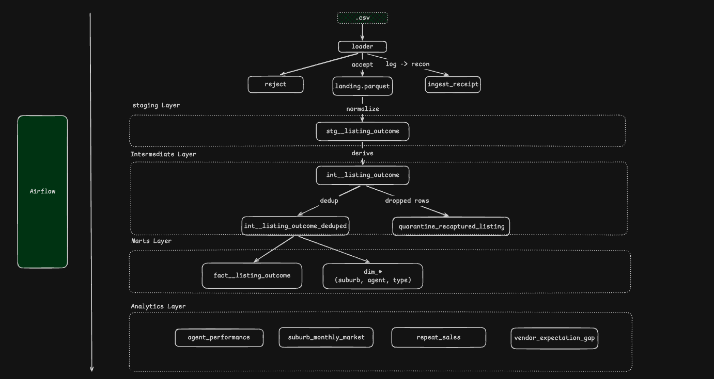

# Melbourne housing pipeline

An end-to-end pipeline over `MELBOURNE_HOUSE_PRICES_LESS.csv`: ingestion with row-level error
handling, a dbt star schema, four analytics models, and an Airflow DAG with a data-quality
gate. Built test-first — 173 tests, no warnings.

```bash
make setup && make all
```

Reproduces the entire warehouse from the source CSV in about 11 seconds. No cloud account, no
credentials, no Docker.

---

## What the data turned out to be

Three findings shaped the design more than any requirement did. Each is measured, not
inferred, and each has a test guarding it.

### 1. `Price` means two different things

`Method` records whether the property actually sold. It often did not.

| | price present | price NULL |
|---|---|---|
| **sold** (`S SP SA SN PN SS`) | 37,469 | 9,324 |
| **not sold** (`PI VB W`) | **10,964** | 5,266 |

**10,964 rows did not sell but still carry a price** — that figure is the highest bid or the
vendor bid, not consideration paid. `AVG(price)` over the priced population is therefore ~23%
contaminated, and it returns a plausible wrong number rather than a null.

So there is no column called `price`. There are two mutually exclusive measures, `sale_price`
and `bid_amount`, and three tests assert no row can ever populate both.

### 2. 5% of the file is the same data republished

860 groups of rows are identical on every column **except `Date`**. 786 of them span exactly
five dates:

```
25/11/2017 Sat 902 │ 09/12/2017 Sat 928     ← real Saturdays vary
16/12/2017 Sat 787 │ 23/12 787 │ 30/12 787 │ 06/01 787 │ 08/01 787 (Mon)
20/01/2018 Sat  19 │ 27/01/2018 Sat  12     ← the real market over the shutdown
```

Five consecutive dates at *exactly* 787 rows, 100% of them duplicated, during the Christmas
auction shutdown when the real market prints 19 and 12. Gaps within groups cluster at 7 days
(2,395) and 2 days (787 — the Saturday-then-Monday capture). The source stopped updating and
republished the 16/12 snapshot four more times, stamped with the capture date.

Note that **any dedup key containing `Date` is structurally blind to this**, because `Date` is
precisely what varies.

Left in, it inflates December–January volume roughly fivefold. Its effect on repeat-sale
analysis is worse: **691 properties appear to have sold twice with a disclosed price; after
the collapse, 174 do. 75% of apparent repeat sales were artefacts.**

### 3. The brief's example metric is not computable

`MELBOURNE_HOUSE_PRICES_LESS.csv` has no `Landsize` or `BuildingArea` column, so *price per
square metre* cannot be derived from it. Enrichment from `Melbourne_housing_FULL.csv` was
measured and rejected: that file covers only 2016-01-28 → 2018-03-17, matches 55.3% of rows,
and yields a computable price/m² for just **8,317 rows (13.2%)** — too thin to carry a headline
metric. **Substitute: price per room and price by property type**, both documented as
deviations.

---

## Architecture



| Layer | Rows | Responsibility |
|---|---|---|
| `data/raw` | 63,023 | the untouched source CSV |
| `data/landing` | 63,023 | typed, contract-checked Parquet — the raw copy |
| `staging` | 63,023 | normalise values. Row-preserving, deliberately |
| `intermediate` | 63,023 → **59,821** | derive meaning, then collapse recaptures |
| `marts` | 59,821 | the star: one fact, six conformed dimensions |
| `analytics` | — | four consumption models |

### The row ledger

```
59,821 (fact)  +  3,202 (quarantine)  =  63,023 (staged)  =  rows_loaded in the ingest receipt
```

That identity is a dbt test, not a comment. Staging is row-preserving so the chain has an
anchor, and every later drop must be matched by a quarantine row carrying its reason. Nothing
can vanish silently.

### Ingestion

The loader streams the CSV, asserts the 13-column header **exactly** (order included — a
positional parse against a drifted header mis-assigns every value), coerces types row by row,
and routes failures to a reason-coded reject store rather than aborting. It writes three
things:

- `data/landing/listing_outcome/load_id=<id>/part-0.parquet` — accepted rows
- `data/rejects/load_id=<id>/part-0.parquet` — rejected rows with reason and original text
- `data/ingest_receipt/<id>.json` — counts, source SHA-256, timings

`load_id` is the source SHA-256 prefix, so re-running against identical bytes overwrites the
same partition instead of accumulating copies. Idempotency is a property of the design, and a
test asserts byte-identical output across runs.

The landing zone is the local stand-in for object storage: pointing this at S3 or GCS is a
path change, not a redesign.

---

## Running it

**Prerequisites:** [uv](https://docs.astral.sh/uv/). Optionally `brew install duckdb` to query
the warehouse interactively.

```bash
make setup     # install dependencies and dbt packages
make all       # ingest + build the whole warehouse
make test      # Python tests, then every dbt model and test
```

| Command | Does |
|---|---|
| `make ingest` | CSV → Parquet landing zone |
| `make build` | every model and every test, in dependency order |
| `make test-unit` | dbt unit tests only — no warehouse data required |
| `make setup-airflow` | install Airflow into its own environment |
| `make test-dag` | Airflow DAG structure tests |
| `make airflow` | run Airflow locally, then trigger `melbourne_housing_pipeline` |
| `make ui` | DuckDB browser UI |
| `make docs` | generate and serve the dbt docs site |
| `make clean` | remove derived data, keep `data/raw` |

### Querying the warehouse

DuckDB has no cloud console. Four ways in:

| How | Command |
|---|---|
| Browser notebook | `duckdb -ui data/warehouse.duckdb` |
| SQL prompt | `duckdb data/warehouse.duckdb` |
| Straight off Parquet — **takes no lock** | `duckdb -c "select * from 'data/landing/**/*.parquet' limit 10"` |
| Model preview | `uv run dbt show --select analytics_suburb_monthly_market --project-dir dbt --profiles-dir dbt` |

**DuckDB is single-writer.** While a build holds the database file, another process cannot
connect at all — `IO Error: Could not set lock on file`, failing at connect time rather than
blocking. Query between runs, or query the Parquet landing zone, which takes no lock. The DAG
sets `max_active_runs=1` for the same reason.

### Orchestration

```
ingest → dbt_build → dq_gate
```

Retries with exponential backoff, `on_failure_callback` posting to Slack (a no-op when
`SLACK_WEBHOOK_URL` is unset, so it runs unconfigured), and a quality gate that reads the
ingest receipt and fails the run on an unreconciled ledger, a reject-rate spike, or a row count
outside the expected band.

The DAG is deliberately coarse. See [ADR-0003](docs/adr/0003-airflow-owns-phases-dbt-owns-lineage.md)
— briefly: dbt already derives the model graph from `ref()`, so mirroring it into Airflow
maintains it twice and only one copy fails loudly when they diverge; and on DuckDB per-model
tasks would have to run through a one-slot pool anyway, making the finer graph illusory. On
BigQuery or Snowflake that trade-off inverts and `astronomer-cosmos` becomes the right answer.

---

## Data dictionary

### `marts.fact__listing_outcome` — 59,821 rows

One row per listing outcome: a campaign for one property on one event date, sold or not.

| Column | Type | Meaning |
|---|---|---|
| `listing_outcome_key` | VARCHAR | Surrogate key. Unique. |
| `property_key` | VARCHAR | → `dim_property` |
| `suburb_key` | VARCHAR | → `dim_suburb`. Denormalised; a test asserts it agrees with the property's suburb |
| `agent_key` | VARCHAR | → `dim_agent` |
| `event_date` | DATE | → `dim_date` |
| `method_code` | VARCHAR | → `dim_sale_method` |
| `type_code` | VARCHAR | → `dim_property_type`. **As at this outcome**, not a fact about the dwelling |
| `rooms` | INTEGER | **As at this outcome** — differs between outcomes for 112 properties |
| `sale_price` | DOUBLE | Consideration paid. Null unless sold **and** disclosed |
| `bid_amount` | DOUBLE | Highest or vendor bid. Null unless **not** sold |
| `sale_price_is_disclosed` | BOOLEAN | True only for a sale with a published price |
| `is_sold` | BOOLEAN | From `dim_sale_method` — the authoritative rule |
| `is_auction` | BOOLEAN | The campaign went under the hammer |
| `load_id` | VARCHAR | Lineage back to the ingest receipt |
| `source_row` | INTEGER | Row number in the source CSV |

### Dimensions

| Table | Rows | Grain and notes |
|---|---|---|
| `dim_suburb` | 377 | Keyed on lowercased name. Holds postcode, region, council, `cbd_distance_km`, `property_count` — all functionally determined by suburb, asserted every build |
| `dim_property` | 58,696 | `(suburb, street address)`. **Identity only** — see below |
| `dim_agent` | 470 | Keyed on lowercased agency name |
| `dim_date` | 1,035 | Generated calendar spine, **not** observed dates. Carries `is_saturday` |
| `dim_sale_method` | 10 | `method_code`, `is_sold`, `is_auction` |
| `dim_property_type` | 6 | `h`, `u`, `t` occur; the rest are carried for completeness |

Suburb and agent counts are **entity** counts. The source holds 380 suburb spellings and 476
agent spellings; case variants (`Croydon`/`croydon`, `VICPROP`/`VICProp`/`Vicprop`) collapse to
377 and 470. Dimensions key on the lowercased value and pick the display spelling by
frequency, tie-broken alphabetically so rebuilds are deterministic.

### `intermediate.quarantine_recaptured_listing` — 3,202 rows

Every excluded row, with `reason`, `surviving_event_date` and
`days_since_previous_appearance`. Quarantined rather than deleted so the exclusion is
provable, inspectable and challengeable.

### Analytics

| Model | Grain | Key metrics |
|---|---|---|
| `analytics_suburb_monthly_market` | suburb × month | clearance rate, median sale price, price per room, MoM change, 3-month average, rank in region |
| `analytics_agent_performance` | agent × region × month | GMV, share of region, `dense_rank`, clearance rate, auction share |
| `analytics_repeat_sales` | resale pair | holding period, gain, annualised return |
| `analytics_vendor_expectation_gap` | bid → later sale | gap amount and percentage, days to sale |

`analytics_suburb_monthly_market` is built over a **complete** suburb × month grid — 12,818
rows, of which 4,630 are zero-activity months. Aggregating only observed months would let
`LAG` compare non-adjacent months while looking entirely correct. That is what `dim_date` is
for.

**A finding worth reading:** across the 211 properties that were passed in at a known figure
and later sold, the market paid a **median 3.9% above** the highest bid, and 143 of 211 sold
above it. Reserves in this market were, on the whole, a little pessimistic.

---

## Transformation logic

| Rule | Where | Why |
|---|---|---|
| Lowercase keys, display names by frequency | `stg__listing_outcome` + dims | Case variants would otherwise become separate dimension members and split an entity's numbers |
| `is_sold` from `Method` | `seed_sale_method` → `int__listing_outcome` | Declared once as reference data rather than restated in every model |
| Split `price` → `sale_price` / `bid_amount` | `int__listing_outcome` | Makes the contaminated-average error structurally impossible |
| Collapse recaptures ≤ 21 days | `int__listing_outcome_clustered` | 3,202 republished snapshots; window guard preserves genuine relistings |
| Rank 1 survives, rest quarantined | `deduped` + `quarantine` | Both derive from one expression, so they cannot drift apart |
| Generated date spine | `dim_date` | Only 112 days carry activity; observed-date dims break window functions silently |

**Why 21 days?** Observed gaps cluster at 2 and 7 days; the next is 14, then 49. The boundary
sits in empty space. Both edges are pinned by unit tests — 21 collapses, 22 does not — so it
cannot drift silently. It remains a judgement call, and the quarantine table exists so anyone
who disagrees can see exactly what it affected.

---

## Testing

173 tests, zero warnings, and a clean rebuild takes 10.6 seconds. **No test is set to `warn`
severity** — a test tuned to be quiet is worse than no test.

| Kind | Count | Runs against |
|---|---|---|
| pytest — loader, quality gate | 37 | fixtures |
| pytest — Airflow DAG structure | 9 | the DAG file |
| dbt unit tests | 36 | mocked rows, no warehouse data |
| dbt data tests | 91 | the built warehouse |

Written test-first for everything with real logic; dimensions and passthrough columns are
contract-tested instead ([ADR-0007](docs/adr/0007-tdd-the-logic-contract-test-the-plumbing.md)).
The git history shows each failing test committed before its implementation.

Two are explicit regression guards against mistakes that are invisible once made:

- **Auction share must not be structurally zero.** Deriving auction participation from a code
  whose rows are filtered out upstream produces a column mathematically incapable of being
  non-zero. It currently reads non-zero for 6,950 agent-months.
- **No repeat-sale pair inside the recapture window.** A seven-day pair at an identical price
  is a republished snapshot, not a resale. Minimum observed holding period: 28 days.

---

## Known limitations

- **No area data**, so price per square metre is replaced by price per room and price by type.
  Enrichment was measured at 13.2% coverage and rejected.
- **The 21-day recapture window is a judgement call.** Defensible from the gap distribution,
  but a judgement nonetheless. The quarantine table makes it auditable.
- **9,324 sales have no disclosed price**, capping price-metric coverage at 59.5% of outcomes.
  Volume and clearance metrics cover 100%.
- **Addresses are unstandardised.** `1/23 Smith St` and `Unit 1, 23 Smith St` would be
  different properties. Property identity is approximate.
- **DuckDB is not a cloud warehouse** — see porting notes below.
- **No incrementality by design** ([ADR-0008](docs/adr/0008-no-incremental-materialisation.md)).
- **The DAG is deliberately coarse** ([ADR-0003](docs/adr/0003-airflow-owns-phases-dbt-owns-lineage.md)).
- **`dim_date` is generated from the data's own range**, so it cannot describe future dates.
- **Suburb attributes are asserted, not guaranteed.** They hold with zero violations here; a
  test fails the build if that ever stops being true.
- **Four business entities are collapsed into one row, and four more are absent.** The source
  gives one row per campaign outcome, so Sales Campaign, Auction Event, Bid and Transaction
  cannot be separated, and Vendor, Buyer, Bidder and Reserve are not captured at all. That
  puts days-on-market, reserve gap, bid depth and buyer behaviour out of reach — a limitation
  of the source, not of the model. See
  [the conceptual model](docs/data-model.md#conceptual-model--the-business-not-the-file).

### Porting to a cloud warehouse

Three things are DuckDB-specific and would change:

1. `generate_series` in `dim_date` → `GENERATE_DATE_ARRAY` (BigQuery) or a recursive CTE /
   `dbt_utils.date_spine` (Snowflake).
2. The `on-run-start` hook registering the landing view → an external table over S3/GCS.
3. `count(*) filter (where …)` → `COUNTIF` on BigQuery.

Everything else — the surrogate keys, window functions and the whole test suite — is portable.
Once on a real warehouse the single-writer constraint disappears, at which point
`astronomer-cosmos` becomes the right way to run dbt from Airflow.

## Future improvements

- **Incremental fact** with a rolling look-back window keyed on the surrogate key, rather than
  a strict watermark that drops same-day arrivals.
- **Address standardisation** and geocoding, which would materially improve property identity
  and unlock the repeat-sale population beyond the current 174 properties.
- **Bring in `Melbourne_housing_FULL.csv`** for building area, land size and coordinates,
  exposing true price per square metre for the 13.2% it covers with coverage stated alongside.
- **Elementary or similar** for test-result history, so a slowly rising reject rate is visible
  as a trend rather than only as a threshold breach.
- **A source freshness check** — the artefact documented above is exactly what a staleness
  check would have caught at ingestion rather than in modelling.
- **CI** running the full suite on every push, with the dbt docs site published as an artifact.
- **Seasonality adjustment** on the suburb series; Melbourne's market has a pronounced spring
  peak and a January trough that currently read as genuine momentum.

---

## AI assistance

Per the brief, a transparent account of where AI was used.

This project was built in a single session with **Claude Code (Claude Opus 5)**, working
interactively rather than by generating a finished repository. The division of labour:

**Directed by me — the decisions:**

- The execution stack (DuckDB), the orchestrator (Airflow) and the deliberately coarse DAG
- The fact grain, the measure split, and the choice to quarantine rather than delete
- Layer naming, the `stg__` / `int__` / `fact__` convention, and the `analytics_` prefix
- Scope: which analytics models, and the decision not to enrich from the FULL file
- The architecture diagram in `docs/architecture.png`, which I drew by hand

**Done by the model:**

- Profiling the source file, which is what surfaced all three findings above. The re-scrape
  artefact and the bid-versus-sale-price overload were discovered by the model interrogating
  the data, not by me knowing to look
- Writing the tests, the loader, the dbt models and the documentation
- Verifying every number quoted in this README against the built warehouse

**Method.** The design was pressure-tested before any code was written: a structured
question-and-answer pass over each decision — engine, orchestrator, grain, measures,
deduplication, testing strategy — with the model arguing for a recommendation and me accepting,
rejecting or redirecting. Ten ADRs and `CONTEXT.md` came out of that, and were committed before
the first line of implementation. Every claim in this README is a measured number, checked
against the warehouse rather than asserted.

Where the model's earlier estimates were wrong, they were corrected from measurement rather
than left standing: the plan predicted ~59,801 surviving rows and 380 suburbs; the built
warehouse holds 59,821 and 377, and the reasons for both differences are documented above.
