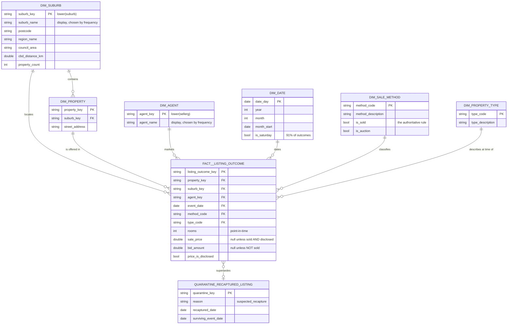

# Data model

What the warehouse is for, what the entities are, and how they relate. Vocabulary is defined
in [CONTEXT.md](../CONTEXT.md); the decisions behind the shape are in [docs/adr](./adr).

## Business questions

The grain and the dimensions exist to serve these. Each question is listed with the smallest
grain that can answer it — that is what forced the fact to be the *listing outcome* rather
than the *sale* (ADR-0004).

| # | Question | Needs | Answered by |
|---|---|---|---|
| 1 | How is a suburb's market performing month to month — volume, clearance, typical price, and is it accelerating? | every outcome, sold or not, at suburb × month | `analytics_suburb_monthly_market` |
| 2 | Which agents win in a given region, and how much of it do they hold? | outcomes attributed to an agent, at agent × region × month | `analytics_agent_performance` |
| 3 | When a property sells twice, how long was it held and what did it return? | two dated sales for the same property | `analytics_repeat_sales` |
| 4 | How far apart are what vendors ask for and what the market pays? | a passed-in bid and a later sale on the same property | `analytics_vendor_expectation_gap` |
| 5 | How much of the market do we actually have prices for, and what did we exclude and why? | the fact plus the quarantine, reconciling to source | `fact__listing_outcome` + `quarantine_recaptured_listing` |

Question 1 is why non-sales are retained: **clearance rate is sales ÷ all outcomes**, so
filtering to sold rows destroys the denominator. Question 4 is only possible because the bid
figure on unsold rows is preserved as a distinct measure (ADR-0005).

## Entities

| Entity | Grain — one row per… | Count | Type |
|---|---|---|---|
| **Listing outcome** | campaign result for one property on one event date | 59,801 | fact |
| **Property** | dwelling, identified by suburb + street address | 58,715 | dimension |
| **Suburb** | suburb | **377** | dimension |
| **Agent** | selling agency | **470** | dimension |
| **Date** | calendar day across the observed range | ~1,000 | dimension (generated spine) |
| **Sale method** | source `Method` code | 10 | dimension (seed) |
| **Property type** | source `Type` code | 6 | dimension (seed) |
| **Recaptured listing** | row excluded as a republished snapshot | 3,222 | quarantine |

Suburb and agent counts are **entity** counts, not distinct-string counts. The source contains
380 suburb spellings and 476 agent spellings; case variants (`Croydon`/`croydon`,
`VICPROP`/`VICProp`/`Vicprop`) collapse these to 377 and 470. Dimensions key on the lowercased
value and choose the display spelling by frequency.

## Relationships

### Cardinality, stated plainly

- A **Suburb** contains **0..\*** Properties; a Property sits in **exactly one** Suburb
  (verified: 0 properties span two suburbs).
- A **Property** has **1..\*** Listing Outcomes. 56,818 have exactly one; 1,897 have more.
- An **Agent** markets **0..\*** Listing Outcomes. A Property is *not* tied to one agent —
  573 properties were marketed by more than one over time.
- Each Listing Outcome has **exactly one** Sale Method, Property Type, Date, Property, Suburb
  and Agent. Every relationship into the fact is many-to-one; there are no many-to-many
  relationships in this model and therefore no bridge tables.

## Why `rooms` and `type` are not attributes of the Property

They look like property characteristics, but the data disagrees: across properties with more
than one outcome, **`rooms` differs for 112** and **`type` differs for 72** — for example
`2/73 Bignell Rd, Bentleigh East` is listed once as a unit and once as a townhouse.

They are therefore recorded **as at the outcome**, not as facts about the dwelling.
`dim_property` holds identity only (suburb + address); `rooms` is a degenerate numeric
attribute on the fact and `type_code` is a point-in-time foreign key. Putting either on
`dim_property` would force an arbitrary choice between contradictory values and silently
rewrite history for the other outcome.

## Why the fact carries `suburb_key` as well as `property_key`

Suburb is reachable through `dim_property`, so this is a deliberate denormalisation: suburb is
the primary analysis grain (question 1), and routing every suburb query through the 58,715-row
property dimension is both slower and easier to get wrong. A singular test asserts
`fact.suburb_key = dim_property.suburb_key` for every row, so the redundancy cannot drift.

## Deliberate omissions

- **No `dim_price_band` or `dim_distance_band`.** Banding is a presentation concern; it lives
  in the analytics layer where the thresholds can change without rebuilding a dimension.
- **No SCD Type 2 anywhere.** Nothing in this source carries an effective date, so there is no
  history to track — every dimension is Type 1.
- **No bridge tables.** Every relationship is many-to-one, as above.
