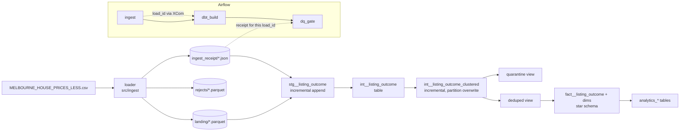

# Melbourne housing pipeline — tech design

## Context and scope

We have one CSV of Melbourne property listings — `MELBOURNE_HOUSE_PRICES_LESS.csv`, 63,023
rows spanning 2016-01-28 to 2018-10-13 — supplied as a file, not a feed contract. The job is
to turn it into a warehouse an analyst can query: ingested with row-level error handling,
modelled as a star schema, deduplicated, tested, incremental, and orchestrated. Everything
must run locally: no cloud account, no Docker, one command.

Profiling the source surfaced two behaviours that drive most of the design:

1. **It republishes.** 858 groups of rows are identical on every column except `Date`, and 786
   of them span exactly five dates — 16/12/2017 through 8/01/2018, each carrying exactly 787
   rows. The feed stopped updating over the Christmas auction shutdown and re-issued the 16/12
   snapshot four more times under new capture dates. Left in, this inflates December–January
   volume roughly fivefold and fabricates hundreds of zero-gain "resales".
2. **It restates.** The same sale appears twice — once as "price not disclosed", later with
   the figure — and the correction carries its *original* event date. Any incremental design
   anchored on "recent" event dates will never see these and will double-count the sale.

The intended production shape is daily files carrying new, repeated and corrected records, so
the design must stay correct when the same record arrives several times across loads.

```
Relevant systems:
- src/ingest/           — Python loader: CSV → Parquet landing + rejects + receipt
- dbt/                  — dbt-duckdb project: staging → intermediate → marts → analytics
- airflow/dags/         — Airflow 3 DAG: ingest → dbt_build → dq_gate
- tests/                — pytest suites + an incremental/full-refresh equivalence harness
Related docs: docs/data-model.md (entity mapping), docs/incremental-design.md (incremental
rationale), docs/warehouse-physical-design.md (BigQuery port), docs/adr/ (decision record),
CONTEXT.md (business glossary)
```

## Goals and non-goals

### Goals

- Answer five business questions: suburb momentum month to month, agent share of a region,
  repeat-sale returns, the gap between vendor expectation and eventual sale price, and a
  provable account of everything excluded.
- **Nothing silently lost.** Every source row must end up in exactly one of: the fact, the
  quarantine, or the reject store — and that chain must be asserted by the build, not hoped.
  On this file the expected ledger is `59,816 fact + 3,207 quarantine = 63,023 staged`.
- Reproducible from a clean clone in one command, rebuilding in seconds.
- Incremental builds **provably identical** to a full rebuild, not assumed identical.
- Test-first for all derivation logic; contract tests for plumbing (ADR-0007).

### Non-goals

- Cloud deployment. The BigQuery port is designed
  ([warehouse-physical-design.md](warehouse-physical-design.md)) but not built.
- Address standardisation or geocoding — property identity stays approximate.
- Retractions. The source cannot say "delete what I published"; supporting that needs
  tombstones in a feed contract that does not exist.
- Seasonality adjustment of the analytics.

### Constraints

- **No cloud accounts, no Docker** — a reviewer must be able to run everything locally
  (ADR-0001). uv provisions Python (`>=3.11,<3.13`) and every dependency.
- **DuckDB is single-writer** — one process holds the database file at a time. This forces a
  coarse orchestration design (ADR-0003) and one active DAG run at a time.
- **Airflow's dependency pins conflict with dbt-core's** — the two tools cannot share an
  environment, so Airflow gets its own (ADR-0002).
- **Restatements carry old event dates** — reprocessing must be scoped by *property*, never
  by an event-date window (ADR-0011).

## Design

### Architecture



### Ingestion (ADR-0009, ADR-0012)

A Python loader streams the CSV, asserts the 13-column header exactly — order included,
because positional parsing against a drifted header silently mis-assigns every value — and
coerces types row by row. A malformed row never fails the load: it goes to the reject store
with a reason code (`wrong_field_count`, `*_not_integer`, `*_out_of_range`, `*_not_numeric`,
`*_not_finite`, `date_not_parseable`, `date_in_future`, `date_implausible`,
`postcode_invalid`) and its original text with CSV quoting intact. Typing also enforces the
narrow band of plausibility typing alone cannot see: `30/12/2087` parses cleanly and is
rejected anyway.

Each load is transactional (ADR-0012). Every output writes under a process-unique
`.inprogress` name and renames into place — rejects, then receipt, then the landing partition
last. **A load exists exactly when its landing partition does**: dbt's landing glob reads
nothing else, so a crash at any point leaves either no visible load or a complete one, and
every partial state re-runs cleanly. `load_id` is the source SHA-256 prefix, so identical
bytes under the same loader version are a no-op that returns the original receipt — its
`started_at` orders loads for restatement survivorship and must never be re-stamped — while a
loader-version change reprocesses, so new coercion rules are never bypassed by an old
partition.

The receipt is the audit record the quality gate evaluates: counts, reject reasons, source
SHA-256, timings, and the event-date span.

### Warehouse layers (ADR-0011)

Materialisation follows one rule: **spend incremental complexity only where row count is
driven by event volume.**

| Layer | Materialisation | Unit of work | Why |
|---|---|---|---|
| `stg__listing_outcome` | incremental, append | the load | Immutable event log; already-staged loads are skipped (`NOT EXISTS` — a null `load_id` under `NOT IN` would silently stop all staging) |
| `int__listing_outcome` | table | — | Windowless row-for-row projection; one linear scan, the deliberate exception to the rule |
| `int__listing_outcome_clustered` | incremental, partition overwrite | **property** | Both dedup rules are windows partitioned by a key containing the property |
| deduped / quarantine | views | — | Complementary filters over one classification; they cannot drift |
| `fact__listing_outcome`, `dim_property` | incremental, partition overwrite | **property** | Grow with event volume |
| other dims, all analytics | table | — | Bounded by dimension cardinality — suburbs × months, agents × region-months — so a full rebuild stays trivially cheap while avoiding the stale-denormalised-attribute class of bug |

### The star (ADR-0004, ADR-0005, ADR-0010)

One fact — `fact__listing_outcome`, one row per campaign outcome for one property on one
event date, sold or not — surrounded by six dimensions: suburb, property, agent, a generated
date spine, sale method, and property type. Every relationship into the fact is many-to-one.
Composite keys — `property_key` (suburb + street address; address alone is not unique) and
`listing_outcome_key` — are `dbt_utils.generate_surrogate_key` MD5 hashes; single-column
dimensions join on natural keys (the lowercased name, the date, or the source code).

The grain is the *outcome*, not the sale. A quarter of the source did not sell, and clearance
rate — the market's headline measure — needs those rows as its denominator. The source's
overloaded `Price` column becomes two mutually exclusive measures: `sale_price` (consideration
paid) and `bid_amount` (highest or vendor bid on an unsold outcome). Profiling shows 10,964
priced rows are bids, so a naive `AVG(price)` is ~23% contaminated — splitting the column
makes that mistake structurally impossible rather than merely documented.

`rooms` and `type_code` live on the fact, not `dim_property`: they differ between outcomes
for the same dwelling, so they are facts about the campaign, not the property. Suburb and
agent dimensions key on the lowercased value (the source spells 380 suburb and 476 agent
variants that collapse to 377 and 470 entities) and pick the display spelling by frequency,
tie-broken alphabetically for deterministic rebuilds.

### Deduplication (ADR-0006)

Three duplication classes need opposite rules, resolved in one expression so survivors and
quarantine are complementary by construction — nothing can fall between them:

| Class | Signature | Expected rows |
|---|---|---|
| `suspected_recapture` | same content, **different** date | 3,200 |
| `suspected_restatement` | same date (same property, method, agent), **different** content | 5 |
| `exact_duplicate` | the same row twice | 2 |

No single key catches both of the first two: a signature containing the price is blind to
restatements, one containing the date is blind to recaptures. Restatements resolve first —
the most recent load wins, then the more informative row — and are excluded from the
recapture chain so a duplicate cannot become a lag anchor. The recapture chain then clusters
identical business signatures whose consecutive appearances sit 21 days or less apart, and
keeps each cluster's earliest row.

The 21-day window is a judgement call made from the observed gap histogram: gaps at or under
21 days cluster at 2 and 7 (the weekly re-scrape cadence), the nearest gap above is 28 days,
so the boundary sits in the widest empty stretch short of collapsing plausible genuine
relistings. Both edges are pinned by unit tests, and everything removed lands in the
quarantine with its reason — the call stays auditable and challengeable rather than final.

### Incremental builds (ADR-0011)

The unit of reprocessing is the **property**, because both dedup rules partition by a key
containing it — so no dedup group can span two properties, and reprocessing a property's
entire history is always complete. A singular test asserts that precondition on every build.
This removes the look-back window rather than sizing it, which matters because an event-date
window is actively wrong here: a restatement arriving today carries a years-old event date.

The orchestrator passes what it just ingested — `dbt build --vars '{"load_ids": [...]}'` —
and every incremental model derives its scope from that one list: delete the affected
properties' partitions in a `pre_hook`, then append their freshly re-derived history.
Not `merge`, and no `unique_key` config: when a later delivery makes an existing outcome a
recapture, its fact row must *stop existing*, which merge cannot express — and `property_key`
is genuinely non-unique in the fact, so declaring it a unique key would assert something
false. Each model's real row key gets an ordinary uniqueness test instead.

With no `load_ids` var, every model degrades to full-refresh behaviour: the incremental path
must never be the only way to get a correct answer. An equivalence harness replays a
realistic delivery sequence — daily files, one re-sent verbatim, one late restatement — and
asserts the incremental warehouse is row-for-row identical to a full rebuild. Sizing: a
median auction day touches ~570 of 58,696 properties, under 1% of history.

### Orchestration (ADR-0002, ADR-0003)

Three Airflow tasks — `ingest → dbt_build → dq_gate` — not one task per dbt model. dbt
already derives the model graph from `ref()`; mirroring it into Airflow maintains the same
graph twice, and DuckDB's single-writer lock would force per-model tasks through a one-slot
pool anyway. `ingest` returns the `load_id`; `dbt_build` templates it into `--vars` and
refuses to run if the XCom is missing rather than scoping dbt to a load that does not exist;
`dq_gate` reads that exact receipt and fails the run on the gate rules. The envelope Airflow
owns: schedule, retries with exponential backoff, an on-failure Slack callback that no-ops
without `SLACK_WEBHOOK_URL`, `catchup=False`, and `max_active_runs=1` for the single-writer
file.

### Alternatives considered

Each recorded with its trade-offs in the decision record ([index](adr/README.md)):

| Decision | Rejected alternatives | ADR |
|---|---|---|
| DuckDB engine | BigQuery/Snowflake (credentials, slow TDD loop), Postgres-in-Docker | [0001](adr/0001-duckdb-as-execution-engine.md) |
| Coarse DAG | `astronomer-cosmos` per-model tasks — right on a cloud warehouse, wrong under a single-writer file | [0003](adr/0003-airflow-owns-phases-dbt-owns-lineage.md) |
| Python loader | `dbt seed`, bare `read_csv_auto` — no row-level error handling | [0009](adr/0009-python-loader-to-parquet-landing.md) |
| Two measures | one `reported_amount` + type discriminator — documents the hazard instead of removing it | [0005](adr/0005-split-price-into-sale-price-and-bid-amount.md) |
| Full refresh first | recorded, then superseded when the intended feed was clarified as daily deltas | [0008](adr/0008-no-incremental-materialisation.md) → [0011](adr/0011-incremental-by-layer.md) |
| delete+insert by property | `merge` (cannot remove), `unique_key` config (asserts something untrue) | [0011](adr/0011-incremental-by-layer.md) |
| Landing as commit marker | receipt as marker — gates nothing, staging LEFT JOINs it; lock files | [0012](adr/0012-landing-partition-as-ingestion-commit-marker.md) |

## Cross-cutting concerns

**Observability.** The ingest receipt is the run's audit record; the quality gate turns it
into a verdict, failing the run on an unreconciled row ledger, a reject rate above 1%, or a
row count outside the 50,000–200,000 band. dbt data tests run at error severity on every
build — nothing sits at `warn`. Failures notify Slack when a webhook is configured.

**Error handling.** Failure modes and required behaviour:

| Failure | Behaviour |
|---|---|
| Header drift | Load fails loudly before any row is read |
| Malformed row | Rejected with reason + original text; load continues |
| Reject spike / volume anomaly / ledger break | `dq_gate` fails the run |
| Crash mid-ingest | Nothing visible to dbt; re-run self-heals (ADR-0012) |
| Duplicate delivery | No-op: same `load_id`, original receipt returned |
| Lost XCom | `dbt_build` exits non-zero rather than building a phantom scope |
| Landing row with null lineage | `not_null` tests on `load_id`/`source_row`/`load_started_at` fail the build |

**Performance.** 63k rows must rebuild in seconds so the red→green loop stays fast enough to
practise TDD. Scoped incremental runs touch under 1% of properties on a median day. On
BigQuery the fact partitions monthly on `event_date` and clusters on
`(suburb_key, property_key)`; the 90-day `incremental_lookback_days` var and its
self-policing assert exist for that port, not the DuckDB build.

**Security and privacy.** Public auction-results data; no credentials in the repo; the only
secret is an optional Slack webhook read from the environment. `data/` is never committed.

**Testing.** Test-first for everything with real derivation logic — the loader's coercion and
rejects, the `is_sold` mapping, the price split, both dedup rules and the window's edges, and
every window function in the analytics — using dbt unit tests against mocked rows so SQL gets
a genuine red→green loop. Dimensions and passthrough columns get schema and contract tests.
Three guards against mistakes that are invisible once made: auction share must not be
structurally zero, no repeat-sale pair may sit inside the recapture window, and no dedup
cluster may exceed the reprocessing look-back. The equivalence harness is the capstone proof
for the incremental design.

**Settings.** `DUCKDB_PATH` (warehouse location), `SLACK_WEBHOOK_URL` (optional), dbt vars
`recapture_window_days` (21), `incremental_lookback_days` (90), `data_root`, and `load_ids`
(the incremental scope, passed by the orchestrator). All runtime-overridable; none require
code changes.
